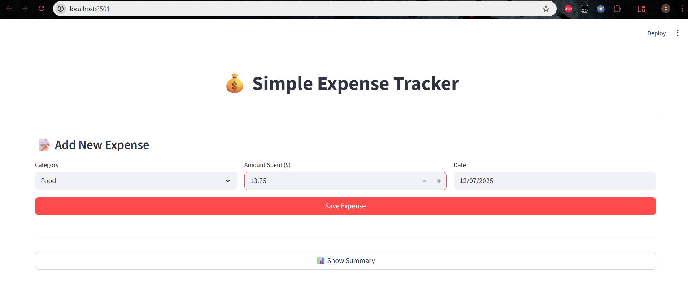
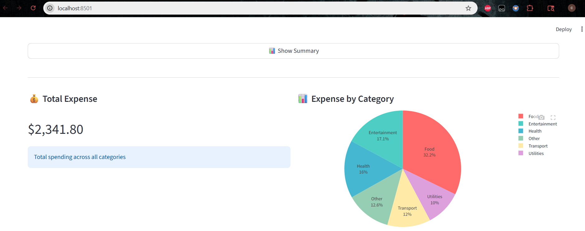
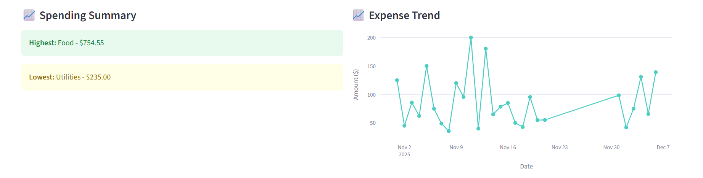

# **Simple Expense Tracker Application** 
A Streamlit-based expense tracking application with a PostgreSQL backend for managing personal expenses with real-time visualizations and analytics.

## **Features**

-  Add expenses with category, amount spent, and date  
-  View total expenses across all categories  
-  Category-wise expense breakdown with pie chart  
-  Expense trends over time with line chart  
-  Identify highest and lowest spending categories  
-  Duplicate expense detection  
-  PostgreSQL database for persistent storage  
-  Clean and intuitive user interface 

## **Screenshots**

### **1. User Interface**


### **2. Summary View – Part 1**


### **3. Summary View – Part 2**


## **Technology Stack**

- **Frontend:** Streamlit 1.52.1  
- **Backend:** Python 3.13  
- **Database:** PostgreSQL 17  
- **Visualization:** Plotly 6.5.0  
- **Database Driver:** pg8000  
- **Environment Management:** Python-dotenv  

## **Prerequisites**

- Python 3.8 or higher
- PostgreSQL 14 or higher
- Git
- pip

## **Installation**

### **1. Clone the Repository**

```bash
git clone https://github.com/KumarTejaChitta/Expense_tracker.git
cd expense-tracker

#Windows PowerShell
python -m venv .venv
.\.venv\Scripts\Activate.ps1

#Windows Command Prompt
python -m venv .venv
.venv\Scripts\activate.bat

#Mac/Linux
python -m venv .venv
source .venv/bin/activate

#Install dependencies
pip install -r requirements.txt
```


## **Database Setup** 
### **1. Create DataBase:**
Open PgAdmin and run:
```sql
CREATE DATABASE expense_tracker;
```

### **2. Create Table:**
Connect to expense_tracker database and run:
```sql
CREATE TABLE expenses (
    id SERIAL PRIMARY KEY,
    category VARCHAR(50) NOT NULL,
    amount DECIMAL(10, 2) NOT NULL,
    date DATE NOT NULL,
    created_at TIMESTAMP DEFAULT CURRENT_TIMESTAMP,
    UNIQUE(category, amount, date)
);
```

## **Configuration**
Create a .env file in the project root with your database credentials:
```python
DB_HOST=localhost
DB_PORT=5432
DB_NAME=expense_tracker
DB_USER=postgres
DB_PASSWORD=your_password_here 
```

## **How to Run Locally**
```bash
# Make sure virtual environment is activated
(.venv) PS D:\expense-tracker>

#Run the application
streamlit run app.py

The application will open in your browser at http://localhost:8501
```


## **Usage**
### **Adding an Expense**

- Select a category from the dropdown (Food, Transport, Utilities, Entertainment, Health, Other)
- Enter the amount spent (automatically rounds to 2 decimal places)
- Choose the date (cannot be before 2023)
- Click "Submit" to save the expense

## **Viewing Summary**

### **Click "Show Summary" button and see insights**  
**View four key insights:** 
- **Total Expense:** Overall spending amount
- **Category Breakdown:** Pie chart showing distribution
- **Highest/Lowest:** Categories with most and least spending
- **Expense Trend:** Line chart showing daily spending patterns

## **Features in Detail**

- **Duplicate Prevention:** System prevents entering the same expense twice
- **Data Validation:** Dates must be from 2023 onwards
- **Amount Formatting:** Automatically formats to 2 decimal places (e.g., 42 → 42.00)
- **Real-time Updates:** Visualizations update immediately after adding expenses

## **Testing**
### **Manual Testing**

**1. Test Data Entry:**

- Add valid expense → Should show success message
- Add duplicate expense → Should show "Already recorded"

**2. Test Visualizations:**

- Click "Show Summary" with no data → Should show appropriate messages
- Add data and check summary → Should display all 4 visualizations

**3. Database Connection Test:**
```bash
- test_db.py
```

## **Troubleshooting**
### **Common Issues**

**1. Database Connection Failed:**

- Check PostgreSQL is running
- Verify credentials in .env file
- Ensure database and table exist

**2. Import Errors:** 

- Activate virtual environment
- Run pip install -r requirements.txt

**3. Blank Streamlit Page:**

- Check terminal for errors
- Try hard refresh (Ctrl+F5)
- Ensure all files are saved


## **Author**
### **Kumar Teja Chitta**
Master's in Data Science, Rowan University


